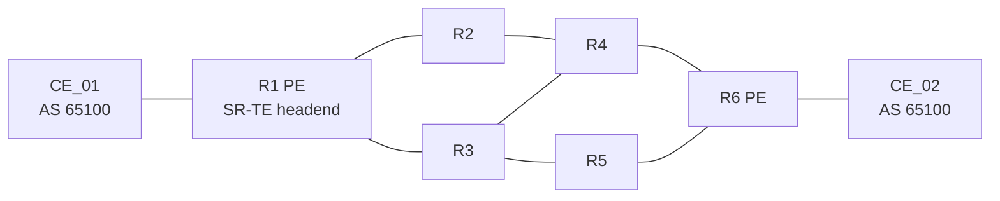

# MPLS Segment Routing Lab on Juniper Junos

An educational, reproducible lab covering **IS-IS, MPLS, SR-MPLS, L3VPN with MP-BGP, and SR-TE** on six Junos core routers and two customer edges. It is built from a working lab: the configurations are the real ones (sanitised), the quoted outputs are real captures, and every known flaw is documented instead of hidden.



## Learning objectives

After the lab you can explain and verify: how IS-IS distributes SRGB and Node-SIDs, how labels are pushed, swapped and popped, how an L3VPN uses a VPN label over an SR transport, how SR-TE segment lists pin a path on the headend, and how to troubleshoot each layer.

## Quick Start (about 5 minutes of reading)

1. **Topology:** AS 65000 core R1 to R6 (links in [docs/topology.md](docs/topology.md)); R1 and R6 are PEs, R2 to R5 are P routers; CE_01 and CE_02 (AS 65100) hang off R1 and R6.
2. **The numbers:** SRGB `800000-819999`; Node-SID index = router number, so R*n*'s label is `80000n` (R4 = 800004, R6 = 800006). Loopbacks are `10.0.0.n/32`.
3. **The service:** VRF `CUSTOMER_A`, RT `65000:1`, VPN label 16, carried between R1 and R6 over iBGP `inet-vpn`. The core runs no BGP.
4. **The engineered path:** R1 is the only SR-TE router. Segment list `800004, 800006` via next hop `10.10.2.2` sends R1 to R6 over **R1, R2, R4, R6**; **R1, R3, R5, R6** is the secondary.
5. **Health check:**

```
show isis adjacency
show spring-traffic-engineering lsp
show route table inet.3 10.0.0.6
show route table CUSTOMER_A.inet.0
show bfd session
```

> **Path engineering in plain terms:** since release 1.1.0, R1's IS-IS metric toward R2 (`ge-0/0/0.0`) is 100. The IGP and plain SR now reach R6 through R3, while the SR-TE primary still goes **R1, R2, R4, R6**, so the engineered path is a genuine detour (captured on R1: [R1-after-fixes.txt](verification/captured/R1-after-fixes.txt)). In release 1.0.0 every link had metric 10 and the primary was one of three equal-cost IGP paths, so SR-TE only pinned a path. See [lab 05](labs/05-sr-te/README.md).

## Supported platform

Junos **25.2R1.9**. The management and interface naming in the captures indicates a virtual MX (vMX); this is inferred, not stated by the author. Emulator: the diagram and notes suggest EVE-NG; see [eve-ng/deployment-guide.md](eve-ng/deployment-guide.md). Resource sizing was not supplied, so none is invented here.

## Prerequisites

Junos CLI basics (`configure`, `load set`, `commit confirmed`), IS-IS and BGP fundamentals, a way to run eight Junos nodes and two hosts. Junos images are not included.

## Full lab walkthrough

Load the stage files on **all** routers, then verify, then move on.

| Lab | Stage | Topic | Stage files |
|---|---|---|---|
| [01](labs/01-base-and-isis/README.md) | 1, 2 | Addressing and IS-IS | [01-base](configs/stages/01-base/), [02-isis](configs/stages/02-isis/) |
| [02](labs/02-mpls/README.md) | 3 | MPLS | [03-mpls](configs/stages/03-mpls/) |
| [03](labs/03-sr-mpls/README.md) | 4, 7 | SR-MPLS, BFD and LFA | [04-segment-routing](configs/stages/04-segment-routing/), [07-protection](configs/stages/07-protection/) |
| [04](labs/04-l3vpn/README.md) | 5 | L3VPN | [05-l3vpn](configs/stages/05-l3vpn/) |
| [05](labs/05-sr-te/README.md) | 6 | SR-TE | [06-sr-te](configs/stages/06-sr-te/) |
| [06](labs/06-troubleshooting/README.md) | 8 | Break-and-fix drills | none |

Or load a complete router at once from [configs/as-captured](configs/as-captured/). Before committing, set a root password (the hashes were removed): `set system root-authentication plain-text-password`. Lines starting with `#` are comments; strip them with `grep -v '^#'` if your loader objects. Hosts (addresses and gateways confirmed by the host traces, see [addressing](docs/addressing.md); VPCS syntax): `ip 10.64.99.10/24 10.64.99.1` and `ip 203.0.113.10/24 203.0.113.1` on the VPCS nodes.

## Expected results

From the author's captures ([verification/](verification/README.md)): all core IS-IS adjacencies `Up`; BFD `Up` on every core link; `R1_TO_R6_SRTE` `Up`; `10.0.0.6/32` active as `SPRING-TE/8` with stack `Push 800006, Push 800004(top)` via `10.10.2.2`; R1 holds `203.0.113.0/24` and R6 holds `10.64.99.0/24` in `CUSTOMER_A` with VPN label 16; P routers run no BGP.
A traceroute from R1's VRF to 10.10.9.1 goes R2, R4, R6, CE_02 (captured), so traffic follows the SR-TE path even though the IGP next hop is R3. Host-to-host traces succeed in both directions (captured): host 1 to host 2 crosses R1, R2, R4, R6 (the SR-TE path), and the unengineered return trace crosses R6, R4, R2, R1. After the 1.1.0 changes (R1): `show route 10.0.0.6` selects IS-IS via `10.10.3.2` only, while `inet.3` keeps `SPRING-TE/8` active via `10.10.2.2` with `Push 800006, Push 800004(top)`.
**Not captured:** CE-side routing tables and a primary-path failure test.

## Documentation

| Topic | File |
|---|---|
| Diagrams (physical, service, SR-TE path, label stack) | [docs/topology.md](docs/topology.md) |
| Addresses, SIDs, VPN parameters | [docs/addressing.md](docs/addressing.md) |
| IS-IS, MPLS, SR-MPLS, protection | [docs/sr-mpls.md](docs/sr-mpls.md) |
| SR-TE | [docs/sr-te.md](docs/sr-te.md) |
| L3VPN | [docs/mpls-l3vpn.md](docs/mpls-l3vpn.md) |
| Design decisions and limits | [docs/design-decisions.md](docs/design-decisions.md) |
| Verification | [docs/verification.md](docs/verification.md) |
| Troubleshooting matrix | [docs/troubleshooting.md](docs/troubleshooting.md) |
| Technical consistency audit | [docs/consistency-audit.md](docs/consistency-audit.md) |
| Config corrections and improvements | [configs/corrections.md](configs/corrections.md) |
| Project metadata and release plan | [docs/project-metadata.md](docs/project-metadata.md) |

## Repository structure

```
.
├── README.md  LICENSE  CONTRIBUTING.md  SECURITY.md  CHANGELOG.md
├── configs/        as-captured/ (sanitised, unmodified) · stages/ · corrections.md · SANITIZATION.md
├── docs/           concepts, diagrams, audit, troubleshooting
├── labs/           01 to 06, each with objective, config, explanation, verify, troubleshoot
├── verification/   raw show-command captures
├── eve-ng/         deployment guide
├── tools/          audit.py, check_links.py
└── .github/workflows/ci.yml
```

## Known issues (documented, not hidden)

The malformed IS-IS NET on R1 was **fixed in release 1.1.0** (original kept in [configs/history](configs/history/1.0.0-junos25.2R1.9/R1.set)). Still open: a redundant `vrf-target`, a non-filtering export policy on R6, `icmp-tunneling` missing on R5, and cosmetic typos. Each has evidence and a separate corrected version in [configs/corrections.md](configs/corrections.md); run `python3 tools/audit.py` to reproduce the findings.

## Contributing

See [CONTRIBUTING.md](CONTRIBUTING.md). Captures from CE_01 and CE_02 and end-to-end tests are the most useful contributions. Security and sanitisation notes: [SECURITY.md](SECURITY.md).

## License

MIT, see [LICENSE](LICENSE). The copyright holder line is a placeholder for the author to complete.

## Disclaimer

Lab material for learning. Not production guidance and not vendor documentation. Configurations are provided as-is; test changes in a lab. Juniper, Junos and vMX are trademarks of Juniper Networks, Inc.; this project is independent. Addresses are private or RFC 5737 documentation ranges.
